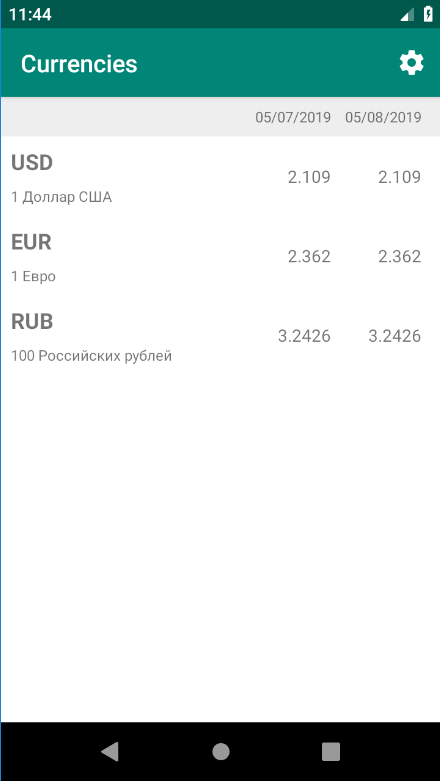
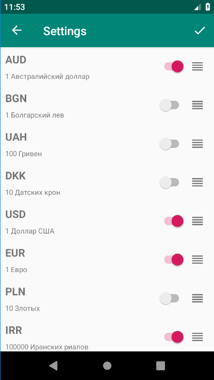

Currency Tracker
================
Android application that allows to see latest exchange rates according to [NBRB](https://www.nbrb.by/).

Introduction
------------
Currency Tracker is an application that allows to see tomorrow's exchange rates compared to today's. If tomorrow's rates are not available, yesterday's and today's rates are used instead. Application also allows to select and rearrange rates user is interested in and save settings between application launches.

Application development language is [Kotlin](https://kotlinlang.org/).

Application is built using MVVM and Observer patterns with help of [Android architecure components](https://developer.android.com/topic/libraries/architecture).

Getting Started
---------------
This project uses the Gradle build system. To build this project, use the
`gradlew build` command or use "Import Project" in Android Studio.

Screenshots
-----------

Libraries Used
--------------
* [Architecture][1] - A collection of libraries that help design robust, testable, and
  maintainable apps. Starting with classes for managing UI components lifecycle and handling data
  persistence.
* [Lifecycles][2] - Create a UI that automatically responds to lifecycle events.
* [LiveData][3] - Build data objects that notify views when the underlying data changes.
* [Navigation][4] - Handle everything needed for in-app navigation.
* [ViewModel][5] - Store UI-related data that isn't destroyed on app rotations.
* [OkHttp][6] - Network calls.

[1]: https://developer.android.com/jetpack/arch/
[2]: https://developer.android.com/topic/libraries/architecture/lifecycle
[3]: https://developer.android.com/topic/libraries/architecture/livedata
[4]: https://developer.android.com/topic/libraries/architecture/navigation/
[5]: https://developer.android.com/topic/libraries/architecture/viewmodel
[6]: https://github.com/square/okhttp